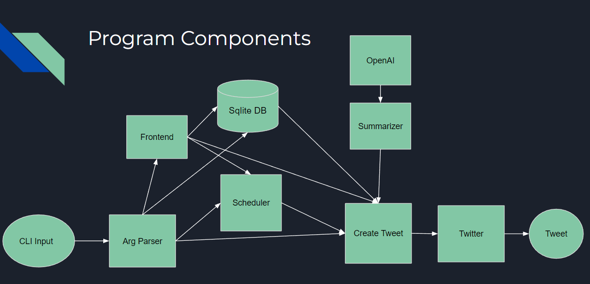

# PuBot

This is a project by Team 60 for CS 222 which in a very basic description is a Twitter bot that tweets daily summaries of the most important ideas from your research publications. Stay ahead of the game and reach a wider audience with the help of PuBot.

- Users can specify what articles/publications the bot should generate tweet summaries from
- Users can change the regularity that the bot tweets summaries from their content
- Users can choose to delete tweets or edit tweets if they find it necessary

### Motivation

- **Improve Accessibility**: PuBot provides tweet summaries of research publications, making complex ideas easier to understand for non-experts or people with limited time.
- **Time-Saving**: PuBot automates the process of summarizing and sharing research findings on social media, saving researchers time and energy.
- **Enhance Visibility**: PuBot tweets regular summaries of research publications, helping researchers increase their visibility, attract more followers, and engage with a wider audience.
- **Flexibility**: PuBot is customizable and allows users to specify the input text, the schedule for tweeting, and editing if necessary

### Architecture



### Roles

We divided into two subteams while working on this project.
**Milind and Ayush**: Worked on frontend using Flask, database system using SQLite, and tweeting functionality using Tweepy and the Twitter API.
**Javier and Michal**: Worked on CLI Input and Arg Parser to run the app with specified arguments, scheduler to publish tweets at a determined frequency, and the summarizer to condense large articles into bite-size tweets using the OpenAI model.

## Installation

1. Clone the repository

```bash
git clone https://github.com/CS222-UIUC/course-project-pubot.git
```

2. Install [Python](https://www.python.org/downloads/) and [Pip](https://pip.pypa.io/en/stable/installation/)

3. Install [Pipenv](https://pypi.org/project/pipenv/)

```bash
pip install pipenv
```

*Note: If you are on Windows, you may need to add the python Scripts folder to your PATH environment variable as indicated in the [Pipenv documentation (see Note)](https://pipenv.pypa.io/en/latest/install/#pragmatic-installation-of-pipenv)*

4. Navigate to the project directory

```bash
cd course-project-pubot
```

5. Install dependencies

```bash
pipenv install --dev
```

or

```bash
python3 -m pipenv install --dev
```

6. Activate the virtual environment

```bash
pipenv shell
```

## Using CLI

See help on usage of CLI:
```bash
python main.py -h
```

```bash
usage: PuBot [-h] [-db DATABASE] {tweet,scheduler,insert,insertwiki,flask} ...

Twitter bot to summarize text

positional arguments:
  {tweet,scheduler,insert,insertwiki,flask}
    tweet               Tweet a summary of a randomly selected text in database
    scheduler           Schedule tweets at a specified interval
    insert              Insert a new article into the database
    insertwiki          Insert a new wikipedia article into the database
    flask               Run the flask server

optional arguments:
  -h, --help            show this help message and exit
  -db DATABASE, --database DATABASE
                        Path to sqlite database file
```

## Testing

1. Activate the virtual environment

```bash
pipenv shell
```

2. Run the tests

```bash
pytest
```

or (without activating the virtual environment)

```bash
pipenv run pytest
```
